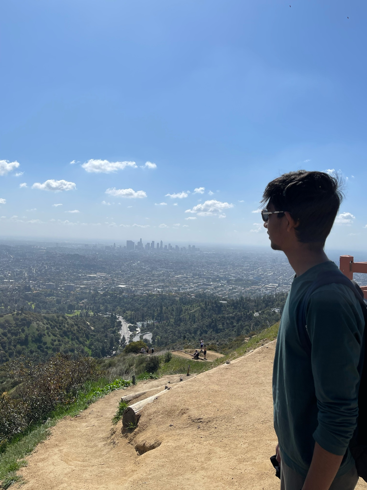

# Sneak peak into Aman!

<!-- Relative Link -->

    

## Guide
1. [About me](#about-me)
   - [Travelling]()
   - [Binge watching]() 
   - [Other fun activities]()
2. [As a programmer]()

## **About me**

Computer Science Sophomore at UCSD - **Go Tritons!**\
Personal Website: [Link](https://amankaggarwal.github.io/)\
Few things I love to do in my free time
- Go on a vacation - Travelling
- Binge watching shows
- Hangout with friends
  - Play sports
  - Play board games
  - Laser Tag
  - Bowling

## Travelling
>Have a free week? Why not go on a roadtrip?\
>Have a free month? Why not visit a new country?

Visiting new places, cultures and meeting new people is one of the most realxing things one could do. 

**Places to visit**
- [ ] Asia
  - [x] India
  - [x] Dubai
  - [x] Singapore
  - [x] Thailand
  - [x] Macao, China
  - [x] Hong Kong
  - [ ] Bali
  - [ ] ...
- [ ] USA
  - [ ] California
    - [ ] ...
  - [x] Nevada
    - [x] Las Vegas
    - [x] Grand Canyon
  - [ ] New York
  - [ ] Chicago, Illinois
- [ ] Europe
  - [ ] Paris
  - [ ] Italy
  - [ ] ...

## Binge watching
> What to do to relax for some time? Answer is binge watch

Generally, I love binge watching shows of genres -
1. Comedy
2. Mystery
3. Action
4. Fantasy

Top 5 Favourite shows:
1. Suits
2. Friends
3. Big Bang Theory
4. Sherlock
5. How I Met Your Mother (the ending :( )

## Playing Sports
> Q: A fun and healthy way of using time?\
> ~~Sleep~~ Play Sports

**Sports I play**
- Tennis
- Basketball
- Ping Pong
- Badminton
- Cricket

